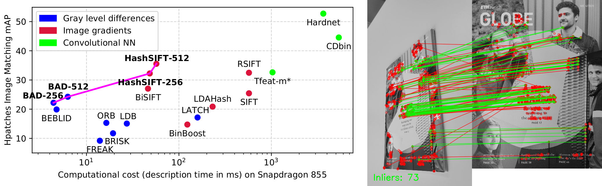

# Revisiting Binary Local Image Description for Resource Limited Devices

This repository contains the source code of **BAD** and **HashSIFT** descriptors presented in "Revisiting Binary Local Image Description for Resource Limited Devices". When accuracy and efficiency are both important, the descriptors in this repository offer the perfect trade-off for real-time applications and resource limited devices like smartphones, robots or drones. 

Code coming soon...
