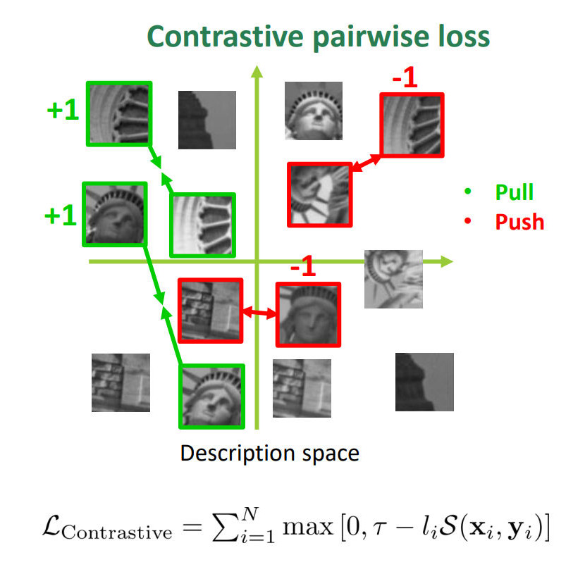
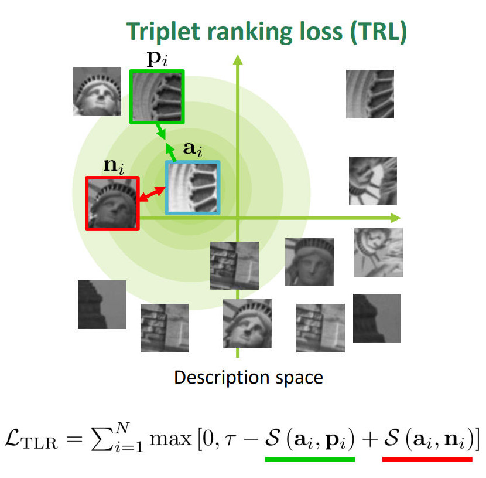
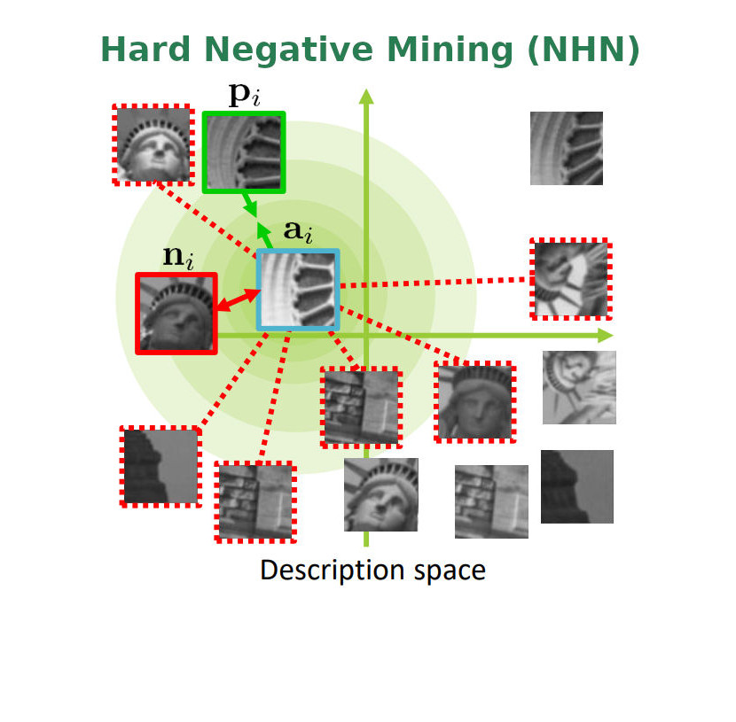

<div width="100%" style="text-align: center;">
	
</div>

## Abstract
<p align="justify">The advent of a panoply of resource limited devices opens up new challenges in the design of computer vision algorithms with a clear compromise between accuracy and computational requirements. In this paper we address this and introduce binary image descriptors that establish new operating points in the state-of-the-art's accuracy vs. resources trade-off curve.
We revisit descriptors based on pixel differences and gradients to introduce respectively BAD (Box Average Difference), the fastest binary descriptor in the literature, and HashSIFT.
They are trained using triplet ranking loss, hard negative mining and anchor swap, combined with a new efficient feature selection algorithm.
In our experiments we evaluate the accuracy, execution time and energy consumption of the proposed descriptors. We show that they are the most accurate when confronted with competing techniques with similar computational requirements. Further, in a planar image registration, HashSIFT  performs  on  par  with  the  top deep learning-based descriptors, being several orders of magnitude more efficient.
</p>

## Video
<div style="text-align:center;">
<video width="100%" autoplay controls muted>
  <source src="imgs/RAL-video-1080p.mp4" type="video/mp4">
Your browser does not support the video tag.
</video>
</div>

## Learning Efficient Local Descriptors

<p>
	The goal of any local feature descriptor is to learn a similarity function \( \mathcal{S}(\cdot, \cdot) \) between local features. 
	We define the training objective \( \mathcal{L}_{\text{TRL}} \)  of our descriptors with the Triplet Ranking Loss (TRL). It brings different descriptions (\( \mathbf{a}_i \), \( \mathbf{p}_i \)) of the same scene point closer while pushing apart descriptors from other scene points \( \mathbf{n}_i \). Its benefit compared with contrastive pair-wise loss is that it is more related to the nearest neighbors matching task, where a good keypoint match is produced only if the correct corresponding keypoint is the close in descriptor distance.
</p>
<p>
	Hard Negative Mining challenges the TRL with different scene points that have the closest description. At each iteration, we choose our negative \( \mathbf{n}_i \) as the hardest in batch (i.e., the one with the smallest descriptor distance).
</p>

<div class="bootstrap-wrapper" style="text-align: center;">
    <div>
        <div class="row align-self-center">
            <div class="col-md-4 color-separated">
            	
            </div>
            <div class="col-md-4 color-separated">
            	
            </div>
            <div class="col-md-4 color-separated">
            	
            </div>
        </div>
    </div>
</div>


## Results
Here we add some extra results showing the performance of the proposed descriptors with other approaches in the State of the Art:

<div class="bootstrap-wrapper" style="text-align: center;">
    <div class="container">
        <div class="row align-self-center"> <!-- Hidden on small screens -->
            <div class="col-md-6">
            	<h4>BAD-256 Reconstruction of Madrid Metropolis</h4>
            	<video width="100%" autoplay muted loop>
				  <source src="imgs/bad256_mad_metropolis_reconstruction.mp4" type="video/mp4">
				Your browser does not support the video tag.
				</video>
            </div>
            <div class="col-md-6">
            	<h4>BAD-512 Fundamental matrix estimation (EuRoC)</h4>
            	
            </div>
        </div>
    </div>
</div>


### ETH Benchmark
Full results table in ETH Benchmark:
<table id="class-eth-results">
    <thead>
        <tr><td></td>
            <td><b># Registered</b></td>
            <td><b># Sparse Points</b></td>
            <td><b># Obervations</b></td>
            <td><b>Track Length</b></td>
            <td><b>Reproj. Error</b></td>
            <td><b># Inliner Pairs</b></td>
            <td><b># Inliner Matches</b></td>
            <td><b># Dense Points</b></td>
        </tr>
    </thead>
    <tbody>
        <tr><td class="eth-db-name" colspan="9">Fountain  (11 images)</td></tr>
        <tr><td>ORB</td><td>11</td><td>15001</td><td>71171</td><td>4.744417</td><td>0.384306</td><td>55</td><td>125033</td><td>306277</td></tr>
        <tr><td>BEBLID-256</td><td>11</td><td>15539</td><td>74044</td><td>4.765043</td><td>0.394489</td><td>55</td><td>133838</td><td>303771</td></tr>
        <tr><td>LATCH</td><td>11</td><td>15384</td><td>73907</td><td>4.804147</td><td>0.401214</td><td>55</td><td>135643</td><td>307421</td></tr>
        <tr><td>BAD-256</td><td>11</td><td>15574</td><td>74404</td><td>4.77745</td><td>0.397276</td><td>55</td><td>135943</td><td>307932</td></tr>
        <tr><td>BAD-512</td><td>11</td><td>15741</td><td>75613</td><td>4.80357</td><td>0.407335</td><td>55</td><td>141365</td><td>305564</td></tr>
        <tr><td>RSIFT</td><td>11</td><td>16167</td><td>77879</td><td>4.817158</td><td>0.433049</td><td>55</td><td>154688</td><td>307027</td></tr>
        <tr><td>Binboost</td><td>11</td><td>15391</td><td>73011</td><td>4.743746</td><td>0.397668</td><td>55</td><td>129571</td><td>302792</td></tr>
        <tr><td>LDAHash-DIF</td><td>11</td><td>15134</td><td>70865</td><td>4.682503</td><td>0.389491</td><td>55</td><td>122713</td><td>304385</td></tr>
        <tr><td>HashSIFT-256</td><td>11</td><td>16086</td><td>77507</td><td>4.818289</td><td>0.427431</td><td>55</td><td>149103</td><td>306132</td></tr>
        <tr><td>HashSIFT-512</td><td>11</td><td>16385</td><td>79082</td><td>4.826488</td><td>0.438388</td><td>55</td><td>156135</td><td>305520</td></tr>
        <tr><td>TFeat-m*</td><td>11</td><td>16278</td><td>78880</td><td>4.845804</td><td>0.431607</td><td>55</td><td>153725</td><td>305073</td></tr>
        <tr><td>HardNet</td><td>11</td><td>17071</td><td>83973</td><td>4.919044</td><td>0.477603</td><td>55</td><td>183331</td><td>305701</td></tr>
        <tr><td>CDbin-256b</td><td>11</td><td>16607</td><td>81360</td><td>4.899139</td><td>0.455184</td><td>55</td><td>168946</td><td>305534</td></tr>
        <!-- -->
        <tr><td class="eth-db-name" colspan="9">Herzjesu (8 images)</td></tr>
        <tr><td>ORB</td><td>8</td><td>7619</td><td>31475</td><td>4.13112</td><td>0.41019</td><td>28</td><td>46625</td><td>237948</td></tr>
        <tr><td>BEBLID-256</td><td>8</td><td>7922</td><td>33414</td><td>4.217874</td><td>0.429793</td><td>28</td><td>51720</td><td>241862</td></tr>
        <tr><td>LATCH</td><td>8</td><td>7871</td><td>33058</td><td>4.199975</td><td>0.430669</td><td>28</td><td>50739</td><td>240523</td></tr>
        <tr><td>BAD-256</td><td>8</td><td>8056</td><td>34038</td><td>4.225174</td><td>0.435542</td><td>28</td><td>53059</td><td>242998</td></tr>
        <tr><td>BAD-512</td><td>8</td><td>8220</td><td>34893</td><td>4.244891</td><td>0.448551</td><td>28</td><td>55866</td><td>236171</td></tr>
        <tr><td>RSIFT</td><td>8</td><td>8533</td><td>36279</td><td>4.251611</td><td>0.476318</td><td>28</td><td>60808</td><td>241740</td></tr>
        <tr><td>Binboost</td><td>8</td><td>7630</td><td>32009</td><td>4.195151</td><td>0.454498</td><td>28</td><td>47763</td><td>233824</td></tr>
        <tr><td>LDAHash-DIF</td><td>8</td><td>7912</td><td>32683</td><td>4.130814</td><td>0.435268</td><td>28</td><td>48765</td><td>244861</td></tr>
        <tr><td>HashSIFT-256</td><td>8</td><td>8560</td><td>36392</td><td>4.251402</td><td>0.473129</td><td>28</td><td>59246</td><td>240978</td></tr>
        <tr><td>HashSIFT-512</td><td>8</td><td>8769</td><td>37376</td><td>4.262288</td><td>0.479877</td><td>28</td><td>62297</td><td>240154</td></tr>
        <tr><td>TFeat-m*</td><td>8</td><td>8631</td><td>36727</td><td>4.255243</td><td>0.476186</td><td>28</td><td>60675</td><td>239675</td></tr>
        <tr><td>HardNet</td><td>8</td><td>9444</td><td>40483</td><td>4.286637</td><td>0.517284</td><td>28</td><td>74867</td><td>239362</td></tr>
        <tr><td>CDbin-256b</td><td>8</td><td>8997</td><td>38650</td><td>4.295876</td><td>0.497678</td><td>28</td><td>67802</td><td>242179</td></tr>
        <!-- -->
        <tr><td class="eth-db-name" colspan="9">South Building (128 images)</td></tr>
        <tr><td>ORB</td><td>128</td><td>137627</td><td>695789</td><td>5.055614</td><td>0.496237</td><td>8128</td><td>2285089</td><td>2137625</td></tr>
        <tr><td>BEBLID-256</td><td>128</td><td>141604</td><td>710290</td><td>5.016031</td><td>0.500718</td><td>8128</td><td>2347648</td><td>2134091</td></tr>
        <tr><td>LATCH</td><td>128</td><td>139584</td><td>716808</td><td>5.135316</td><td>0.521234</td><td>8128</td><td>2345677</td><td>2144368</td></tr>
        <tr><td>BAD-256</td><td>128</td><td>145771</td><td>727953</td><td>4.993812</td><td>0.515675</td><td>8128</td><td>2435017</td><td>2145993</td></tr>
        <tr><td>BAD-512</td><td>128</td><td>148491</td><td>744604</td><td>5.014472</td><td>0.527237</td><td>8128</td><td>2533879</td><td>2127316</td></tr>
        <tr><td>RSIFT</td><td>128</td><td>155195</td><td>798456</td><td>5.144856</td><td>0.58171</td><td>8128</td><td>2836156</td><td>2139778</td></tr>
        <tr><td>Binboost</td><td>128</td><td>135186</td><td>690751</td><td>5.109634</td><td>0.510165</td><td>8128</td><td>2220460</td><td>2156847</td></tr>
        <tr><td>LDAHash-DIF</td><td>128</td><td>141248</td><td>705928</td><td>4.997791</td><td>0.511755</td><td>8128</td><td>2469511</td><td>2132395</td></tr>
        <tr><td>HashSIFT-256</td><td>128</td><td>149102</td><td>764699</td><td>5.128697</td><td>0.563444</td><td>8128</td><td>2718812</td><td>2116461</td></tr>
        <tr><td>HashSIFT-512</td><td>128</td><td>156888</td><td>798948</td><td>5.092474</td><td>0.581466</td><td>8128</td><td>2904787</td><td>2142022</td></tr>
        <tr><td>Tfeat-m*</td><td>128</td><td>152834</td><td>775159</td><td>5.071902</td><td>0.574171</td><td>8128</td><td>2721956</td><td>2149925</td></tr>
        <tr><td>HardNet</td><td>128</td><td>168536</td><td>878847</td><td>5.214595</td><td>0.642522</td><td>8128</td><td>3344759</td><td>2122914</td></tr>
        <tr><td>CDbin-256b</td><td>128</td><td>160589</td><td>832281</td><td>5.182678</td><td>0.616106</td><td>8128</td><td>3124870</td><td>2128460</td></tr>
        <!-- -->
        <tr><td class="eth-db-name" colspan="9">Madrid Metropolis (1344 images)</td></tr>
        <tr><td>ORB</td><td>457</td><td>135826</td><td>576138</td><td>4.241736</td><td>0.641296</td><td>898475</td><td>77323855</td><td>1085693</td></tr>
        <tr><td>BEBLID-256</td><td>549</td><td>174257</td><td>705651</td><td>4.049484</td><td>0.656167</td><td>898491</td><td>78223028</td><td>1153261</td></tr>
        <tr><td>LATCH</td><td>573</td><td>186886</td><td>759581</td><td>4.064408</td><td>0.655908</td><td>898825</td><td>66395879</td><td>1245053</td></tr>
        <tr><td>BAD-256</td><td>600</td><td>192638</td><td>789466</td><td>4.098184</td><td>0.675328</td><td>898344</td><td>72555880</td><td>1236144</td></tr>
        <tr><td>BAD-512</td><td>622</td><td>189523</td><td>812243</td><td>4.285723</td><td>0.677531</td><td>898327</td><td>68242893</td><td>1268840</td></tr>
        <tr><td>RSIFT</td><td>729</td><td>286519</td><td>1136306</td><td>3.965901</td><td>0.678011</td><td>898184</td><td>77745627</td><td>1349061</td></tr>
        <tr><td>Binboost</td><td>514</td><td>143622</td><td>629993</td><td>4.386466</td><td>0.668252</td><td>897792</td><td>67946197</td><td>1129936</td></tr>
        <tr><td>LDAHash-DIF</td><td>592</td><td>233862</td><td>804944</td><td>3.441961</td><td>0.642139</td><td>898544</td><td>95827306</td><td>1046695</td></tr>
        <tr><td>HashSIFT-256</td><td>720</td><td>298920</td><td>1075450</td><td>3.597785</td><td>0.667772</td><td>898464</td><td>88150278</td><td>1202895</td></tr>
        <tr><td>HashSIFT-512</td><td>720</td><td>305237</td><td>1160738</td><td>3.802743</td><td>0.686795</td><td>898459</td><td>87769325</td><td>1387138</td></tr>
        <tr><td>TFeat-m*</td><td>690</td><td>262790</td><td>986470</td><td>3.753834</td><td>0.677615</td><td>897709</td><td>75823683</td><td>1233791</td></tr>
        <tr><td>HardNet</td><td>849</td><td>359610</td><td>1438909</td><td>4.001304</td><td>0.701354</td><td>898257</td><td>79144113</td><td>1436234</td></tr>
        <tr><td>CDbin-256b</td><td>769</td><td>260690</td><td>1108018</td><td>4.250328</td><td>0.696556</td><td>898274</td><td>79222034</td><td>1347656</td></tr>
    </tbody>
</table>

## Citation

If you use this project please cite:

```
@article{suarez2021revisiting,
  title={Revisiting Binary Local Image Description for Resource Limited Devices},
  author={Su{\'a}rez, Iago and Buenaposada, Jos{\'e} M and Baumela, Luis},
  journal={IEEE Robotics and Automation Letters},
  volume={6},
  number={4},
  pages={8317--8324},
  year={2021},
  publisher={IEEE}
}

```